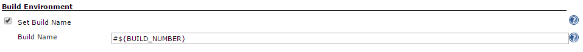
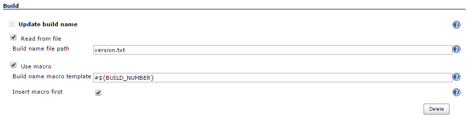
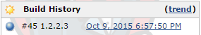

# Jenkins-build-name-setter-plugin

This plugin sets the display name of a build to something other than #1, #2, #3, ... so that you can use an identifier
that makes more sense in your context. When you install this plugin, your job configuration page gets additional setting
that lets you specify a build name for each new build.

As the result you can obtain something like this:

Memo:
token-macro is not optional from version:1.6.0
